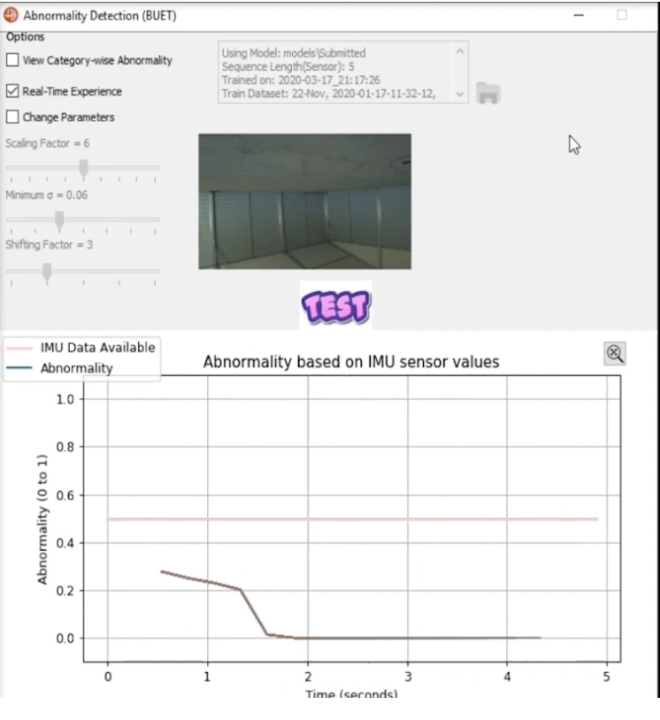
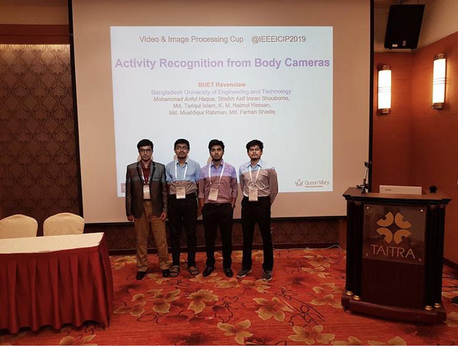

 
 

# Student Competitions

<table style='font-size:150%'>
     <tr>
          <td><a href="http://naimulhassan.github.io/content/papers/sp2020.pdf">IEEE Signal Processing (SP) Cup 2020: Unsupervised abnormality detection by using intelligent and heterogenous autonomous system</a></td>
          <td>Team: BUET Ravenclaw 
          Undergraduate Team Members: Shafin Bin Hamid, Munshi Sanowar Raihan, Ashiqur Rasul, Himaddri Roy, Prasun Datta, Mushfiqur Rahman & <i>K M Naimul Hassan</i> 
          Supervisor: Dr. Mohammad Ariful Haque 
          Final at 45th IEEE International Conference on Acoustics, Speech and Signal Processing (ICASSP) 2020, Barcelona, Spain. [Organized as a Virtual Conference] 
          

          
          
</td>
     </tr>
     <tr>
          <td><a href="http://naimulhassan.github.io/content/papers/vip2019.pdf">IEEE Video and Image Processing (VIP) Cup 2019: Privacy-aware office activity recognition from First Person View (FPV) body cameras</a></td>
          <td>Team: BUET Ravenclaw 
          Undergraduate Team Members: [from left] Sheikh Asif Imran Shouborno, Md. Mushfiqur Rahman, Md. Tariqul Islam & <i>K M Naimul Hassan</i> 
          Supervisor: Dr. Mohammad Ariful Haque 
          Final at 26th IEEE Conference on Image Processing (ICIP) 2019, Taipei, Taiwan 
          

          
          
</td>
     </tr>

</table>

---
## Other Honors/Achievements
For a complete list of honor/achievements, see my [Academic CV][academic-cv].

[academic-cv]: http://naimulhassan.github.io/content/papers/naimulCV.pdf