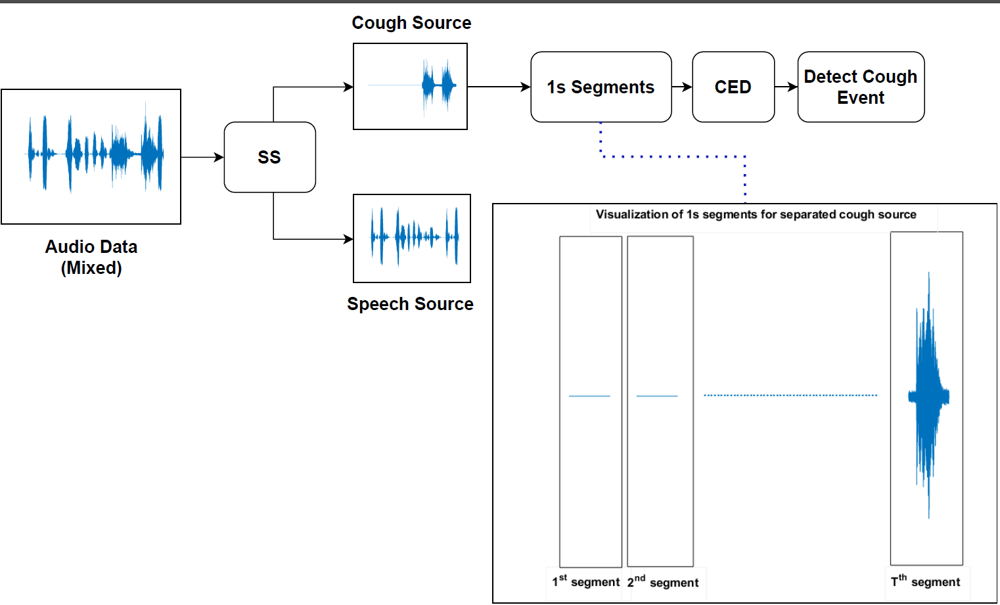
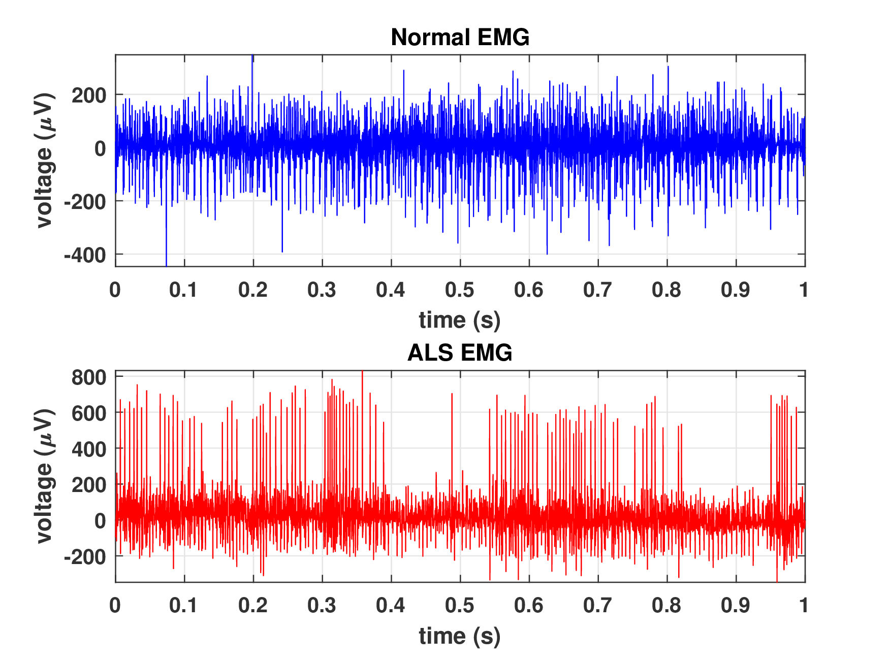
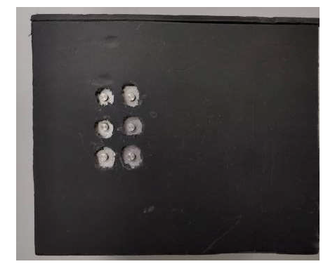
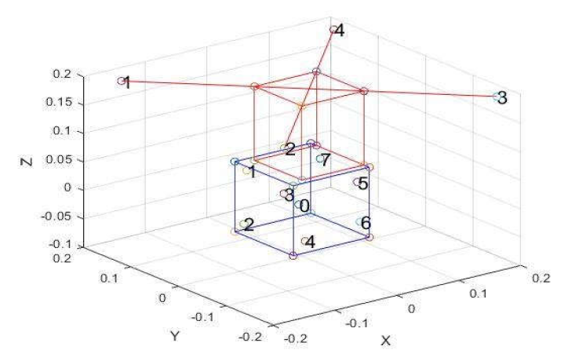
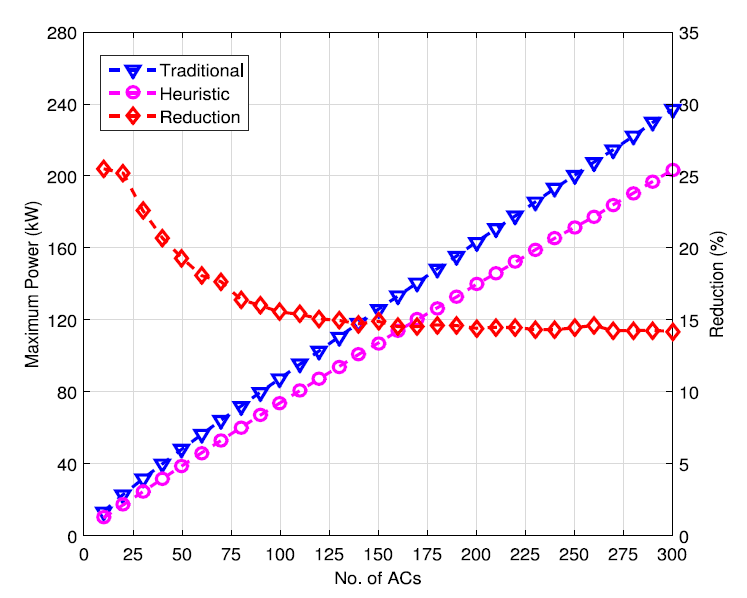
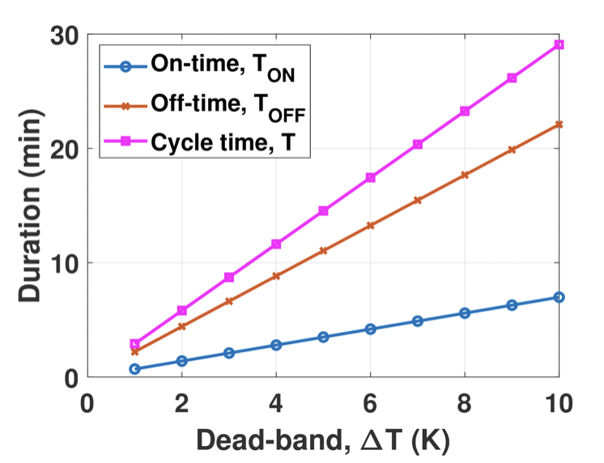

<link rel="stylesheet" href="https://cdn.jsdelivr.net/npm/@fortawesome/fontawesome-free@5.15.4/css/fontawesome.min.css" integrity="sha384-jLKHWM3JRmfMU0A5x5AkjWkw/EYfGUAGagvnfryNV3F9VqM98XiIH7VBGVoxVSc7" crossorigin="anonymous">

<a style="padding-right:20px !important" href="https://scholar.google.com/citations?user=ondPg7wAAAAJ&hl=en&oi=sra"><i class="ai ai-google-scholar-square ai-5x"></i></a>
<a style="padding-right:20px !important" href="https://github.com/NaimulHassan"><i class="fa fa-github fa-5x"></i></a>

 
 

---
# Machine Learning/Deep Learning/Signal Processing

<table style='font-size:150%'>
     <tr>
          <td><a href="http://naimulhassan.github.io/content/papers/SS+CEDNet.pdf">SS+CEDNet: A Speech Privacy Aware Cough Detection Pipeline by Separating Sources</a>; <i>K. M. Naimul Hassan</i>, Mohammad Ariful Haque; <b>IEEE R-10 Humanitarian Technology Conference (HTC)</b>; 2022.
          <td>Cough is one of the most distinguishable symptoms for Influenza-like-illness (ILI) and Severe Acute Respiratory Infection (SARI). Considering the recent worldwide COVID-19 pandemic, many types of research are ongoing all around the world for the accurate detection of cough events. But background speech events make it difficult for the algorithms to detect cough events and the performance of the models drops significantly. At the same time, speech privacy is not preserved in the traditional cough detection models. In this paper, we are proposing a pipeline, named SS+CEDNet, to overcome these problems. The pipeline consists of a Source Separation (SS) and a Cough Event Detection (CED) model. The SS model at first separates the cough and speech sources. Finally, the separated cough source is passed through the CED model to detect cough events. The pipeline not only preserves speech privacy by separating the sources but also shows a better cough detection accuracy.
          

          
          
</td>
     </tr>
     <tr>
          <td><a href="http://naimulhassan.github.io/content/papers/alsnet.pdf">ALSNet: A Dilated 1-D CNN for Identifying ALS from Raw EMG Signal</a>; <i>K. M. Naimul Hassan</i>, Md. Shamiul Alam Hridoy, Naima Tasnim, Atia Faria Chowdhury, Tanvir Alam Roni, Sheikh Tabrez, Arik Subhana, Celia Shahnaz; <b>IEEE International Conference on Acoustics, Speech and Signal Processing (ICASSP)</b>; 2022.  </td>
          <td>Amyotrophic Lateral Sclerosis (ALS) is one of the most common neuromuscular diseases which affects both lower and upper motor neurons. In this paper, a dilated one dimensional convolutional neural network, named ALSNet, is proposed for identifying ALS from raw EMG signal. No hand-crafted feature extraction is required, rather, ALSNet is able to take raw EMG signal as input and detect EMG signals of ALS subjects. This makes the method more feasible for practical implementation by reducing the computational cost required for extracting features. To our best knowledge, no research work for identification of ALS from raw EMG signal has been conducted yet. The performance of the ALSNet was evaluated using popular metrics such as overall accuracy, sensitivity, specificity and balanced accuracy and compared with other existing methods. The proposed method showed a better performance than the other existing methods with an overall accuracy of 97.74%.
          

          
          
</td>
     </tr>
     <tr>
          <td><a href="http://naimulhassan.github.io/content/papers/doanet-ssl.pdf">DOANet: a deep dilated convolutional neural network approach for search and rescue with drone-embedded sound source localization</a>; Alif Bin Abdul Qayyum, <i>K. M. Naimul Hassan</i>, Adrita Anika, Md. Farhan Shadiq, Md. Mushfiqur Rahman, Md. Tariqul Islam, Sheikh Asif Imran, Shahruk Hossain & Mohammad Ariful Haque; <b>EURASIP Journal on Audio, Speech and Music Processing</b>; 2020.  </td>
          <td>Drone-embedded sound source localization (SSL) has interesting application perspective in challenging search and rescue scenarios due to bad lighting conditions or occlusions. However, the problem gets complicated by severe drone ego-noise that may result in negative signal-to-noise ratios in the recorded microphone signals. In this paper, we present our work on drone-embedded SSL using recordings from an 8-channel cube-shaped microphone array embedded in an unmanned aerial vehicle (UAV). We use angular spectrum-based TDOA (time difference of arrival) estimation methods such as generalized cross-correlation phase-transform (GCC-PHAT), minimum-variance-distortion-less-response (MVDR) as baseline, which are state-of-the-art techniques for SSL. Though we improve the baseline method by reducing ego-noise using speed correlated harmonics cancellation (SCHC) technique, our main focus is to utilize deep learning techniques to solve this challenging problem. Here, we propose an end-to-end deep learning model, called DOANet, for SSL. DOANet is based on a one-dimensional dilated convolutional neural network that computes the azimuth and elevation angles of the target sound source from the raw audio signal. The advantage of using DOANet is that it does not require any hand-crafted audio features or ego-noise reduction for DOA estimation. We then evaluate the SSL performance using the proposed and baseline methods and find that the DOANet shows promising results compared to both the angular spectrum methods with and without SCHC. To evaluate the different methods, we also introduce a well-known parameter—area under the curve (AUC) of cumulative histogram plots of angular deviations—as a performance indicator which, to our knowledge, has not been used as a performance indicator for this sort of problem before.
          

          
          
</td>
     </tr> 
     <tr>
          <td><a href="http://naimulhassan.github.io/content/papers/braille.pdf">A Dual-Purpose Refreshable Braille Display Based on Real Time Object Detection and Optical Character Recognition</a>; <i>K. M. Naimul Hassan</i>, Subrata Kumar Biswas, Md Shakil Anwar, Md Shakhrul Iman Siam, Celia Shahnaz; <b>IEEE International Conference on Signal Processing, Information, Communication & Systems (SPICSCON)</b>; 2019.  </td>
          <td>This paper proposes a dual-purpose braille system for the visually impaired people. There are two main features of this system- object detection and optical character recognition. Real time object detection will help a visually impaired person to know about the things around him and optical character recognition will help him reading characters in both international (English) and local community (Bengali) language. In this paper, the detailed methodology of our proposed method is described. A pre-trained convolutional neural network (AlexNet) is used for classifying the objects and an OCR engine (Tesseract) along with basic image processing is used for optical character recognition. A refreshable braille display is also designed to show the braille characters.
          

          
          
</td>
     </tr>
     <tr>
          <td><a href="http://naimulhassan.github.io/content/papers/gsc-beamform.pdf">Direction of Arrival Estimation through Noise Suppression: A Novel Approach using GSC Beamforming and Room Acoustic Simulation</a>; Alif Bin Abdul Abdul Qayyum, Adrita Anika, Md. Messal Monem Miah, Md. Mushfiqur Rahman, <i>K. M. Naimul Hasan</i>, Md. Tariqul Islam, Sheikh Asif Imran Shouborno, Md. Farhan Shadiq, Mohammad Ariful Haque; <b>IEEE International Conference on Signal Processing, Information, Communication & Systems (SPICSCON)</b>; 2019.</td>
          <td>A novel method for localizing or estimating the direction of a sound source from the speech mixed with different levels of noise recorded by a microphone array embedded in an Unmanned Aerial Vehicle (UAV) has been proposed in this paper. Publicly available DREGON dataset (The IEEE Signal Processing CUP 2019 dataset for static task) has been used. The detail methodology of the system for localizing the sound source in static condition of the UAV is described in this paper. Generalized Sidelobe Canceller (GSC) Beamformer on the noisy audio is used to extract the noise along the rotor directions. This extracted noise is the simulated to synthesize 8 channel audio using pyroomacoustics. Finally the extracted noise is used as the reference of the wiener filter for filtering the noise in the provided noisy audios. GCC PHAT and GCC NON LIN methods are used to estimate the elevation and azimuth of the sound source. Promising results have been found using this method to localize the sound source of human speech from the audios of snr as low as −20 dB recoreded by a microphone array embedded on a UAV. If at most 10° of error in angle is allowed, our proposed method provides an accuracy of almost 91.67%.
          

          
          
</td>
     </tr>

     

</table>

---
# Smart Grid

<table style='font-size:150%'>
     <tr>
          <td><a href="http://naimulhassan.github.io/content/papers/peak-load-min.pdf">Peak load minimization in smart grid by optimal coordinated ON–OFF scheduling of air conditioning compressors</a>; Md Forkan Uddin, <i>K. M. Naimul Hassan</i>, Soumav Biswas; <b>Elsevier Sustainable Energy, Grids and Networks</b>; 2021.  </td>
          <td>We address the problem of minimizing the peak load by optimal coordinated ON–OFF scheduling of the compressors of air conditioners (ACs) connected in a smart grid. For this purpose, we consider a simplified model of power consumption profile, i.e., on-time and off-time durations and power consumption values of a split type AC. We model the necessary constraints and formulate an optimization problem to minimize the peak load by optimal coordinated ON–OFF scheduling of the AC compressors. The optimization problem is found to be a complex mixed integer linear programming problem. We optimally solve the problem for a small number of ACs by using an optimization tool. Unfortunately, due to the computational complexity, the tool cannot solve the problem for a large number of ACs. For a large number of ACs, we develop a heuristic algorithm to solve the problem. Using the optimization tool and the heuristic algorithm, we determine the peak load, load variance, and energy consumption in operating a number of ACs and compare them with the results obtained for a traditional non-coordinated AC operation. We find that both the optimal and heuristic solution approaches significantly reduce the peak load and load variance with some increment of energy consumption. Further, the computation time of the scheduling of the AC compressors of an air conditioning system under the heuristic algorithm is found to be significantly less compared to the time bound on scheduling computation of the AC compressors even when the number of ACs in the system is large.
          

          
          
</td>
     </tr>
     <tr>
          <td><a href="http://naimulhassan.github.io/content/papers/profile-modelling-sg.pdf">Electrical Power Consumption Profile Modelling of of Air Conditioner for Smart Grid Load Management</a>; <i>K. M. Naimul Hassan</i>, Soumav Biswas & Md. Forkan Uddin; <b>11th International Conference on Electrical and Computer Engineering (ICECE)</b>; 2020.  </td>
          <td>Air conditioning (AC) system will be an inherent part of smart grid (SG) demand response as it is responsible for a substantial amount of power consumption in total infrastructure. It is invaluable to estimate the nature of operational characteristics of AC compressors in order to implement associated optimization strategy for energy preservation in residential premises. In this paper, the electrical power consumption profile, i.e., On-time and Off-time durations and power consumptions during these time durations is modelled for a split type AC compressor in terms of co-efficient of performance, AC capacity and environment condition. Dead-band temperature and room dimensions are considered as environment condition and the effect of various parameters on On-time and Off-time durations and energy consumption is studied. The factors that can be optimized to reduce the energy consumption are also analyzed.
          

          
          

          </td>
     </tr>
</table>